# Noctua

**AI-powered PR intelligence that watches while you sleep.**

Every pull request automatically summarized, security-scanned, Code DNA fingerprinted, and reviewed in the personality of your choice — all before a human opens the diff.

---

## Screenshots

### Landing Page
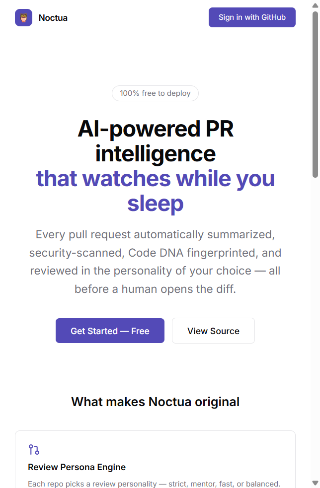

### Login — with Demo Mode
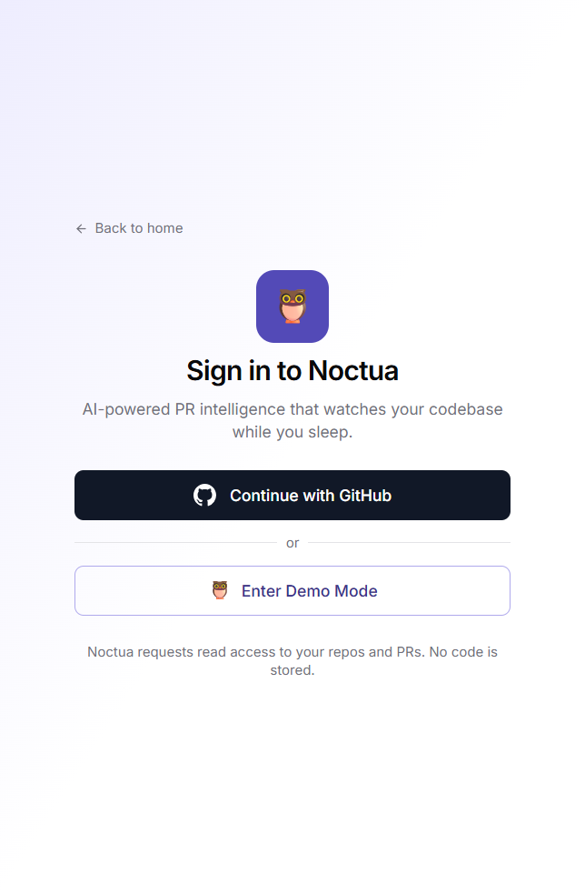

### Dashboard — Stat Cards
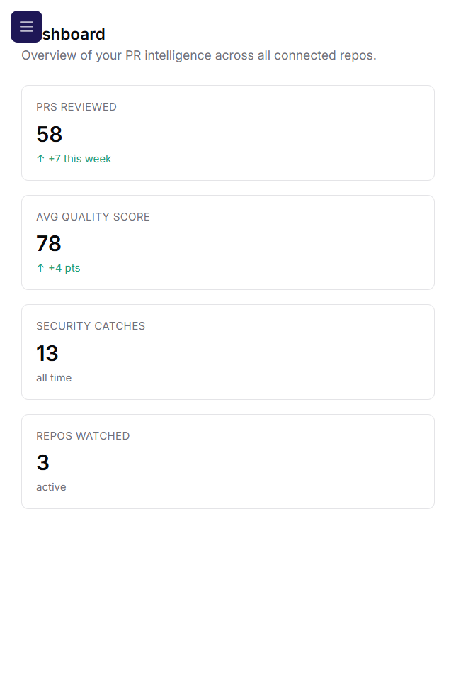

### Pull Request Feed
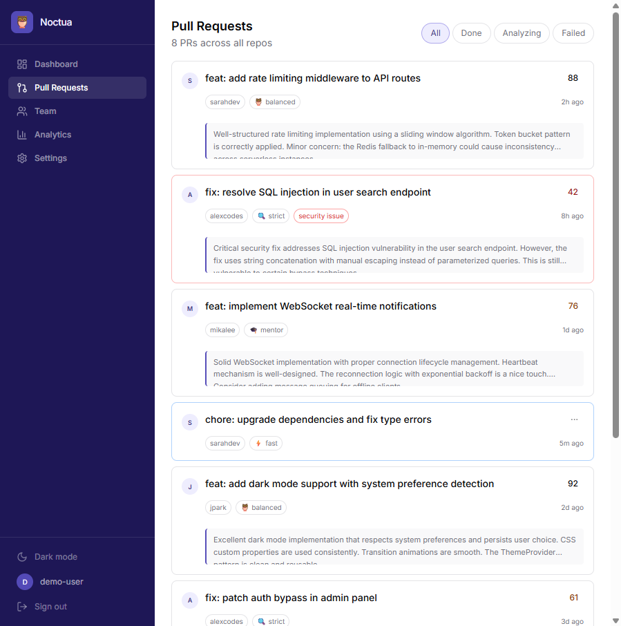

### PR Detail — Score Gauge, AI Summary, Security Issues, Suggestions
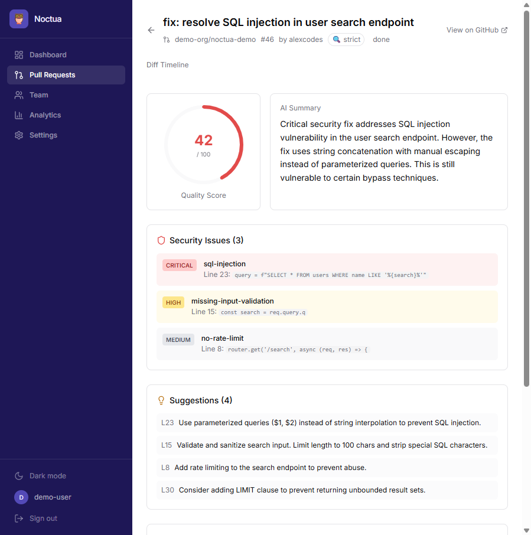

### Team Clarity Leaderboard
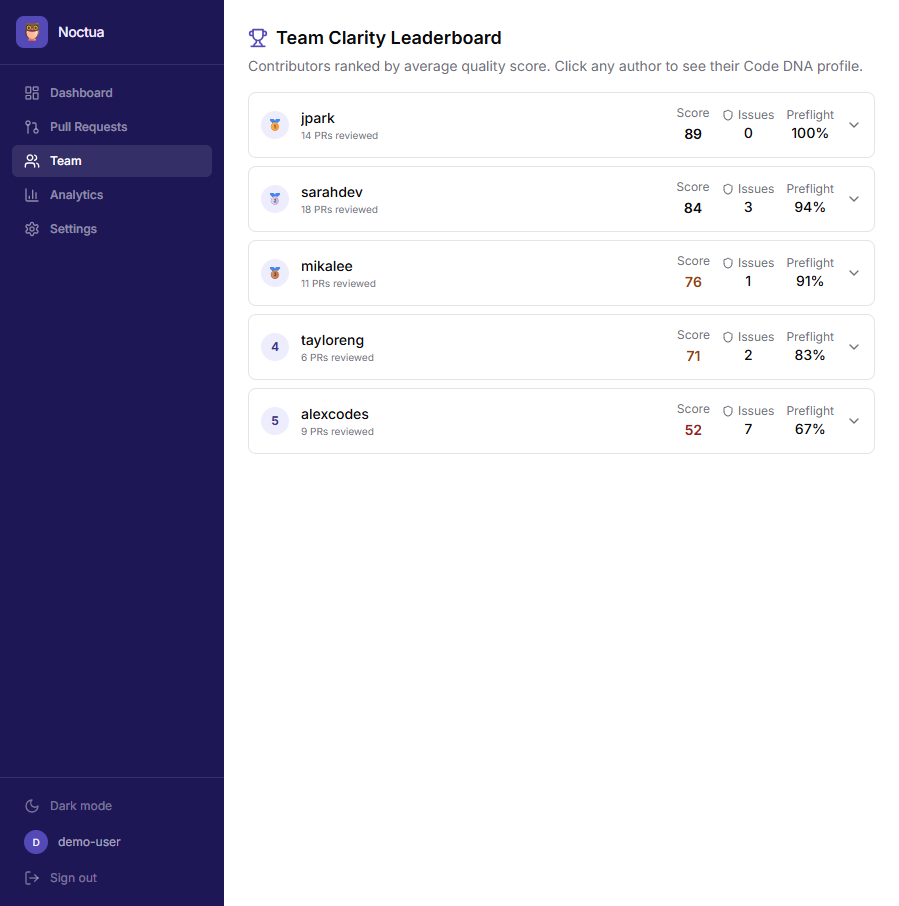

### Analytics — Quality Trends, Security Metrics, PR Volume
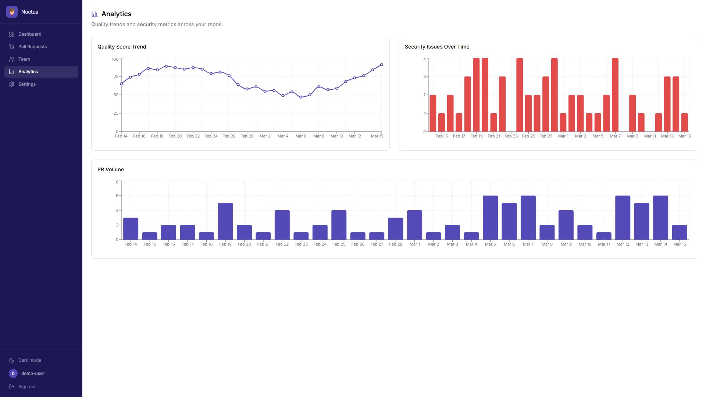

### Settings — Repo Management & Persona Selection
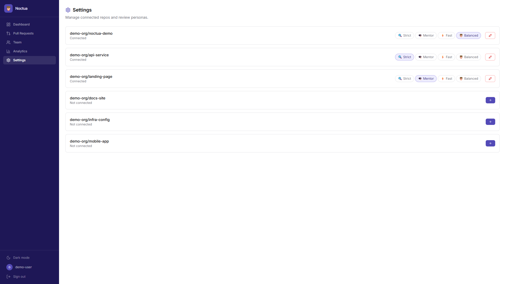

### Dark Mode
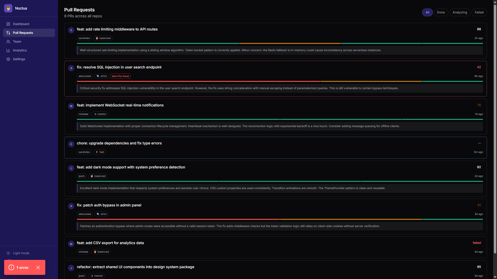

### 404 Page
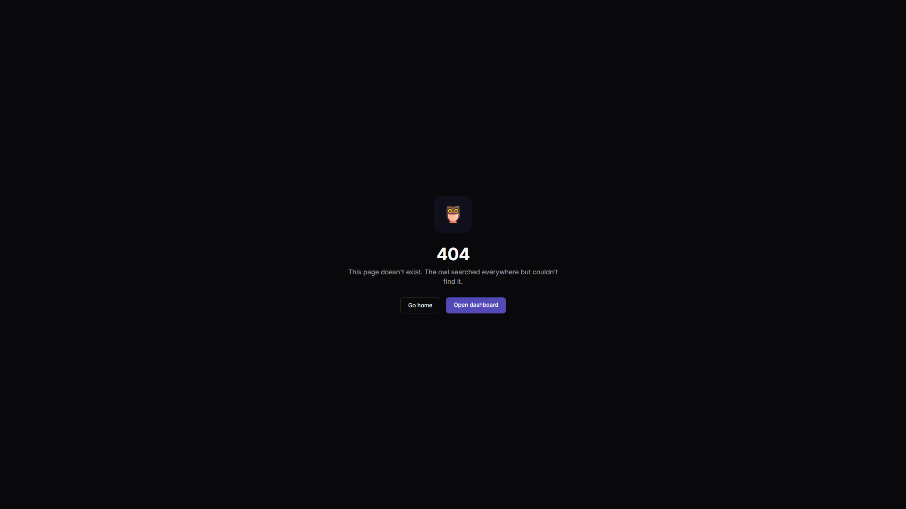

---

## What Makes Noctua Original

| Feature | Description |
|---------|-------------|
| **Review Persona Engine** | Each repo picks a review personality — strict, mentor, fast, or balanced. The AI prompt and scoring math change completely per persona. |
| **Code DNA Fingerprinting** | Builds a per-author coding profile across every PR — line length, comment ratio, nesting depth, type hints, naming consistency. |
| **Pre-flight Check** | A GitHub Action calls `/preflight` before a PR is opened. Blocks pushes with critical security issues at commit time. |
| **Diff Timeline Heatmap** | A proportional visual strip showing where changes cluster — green for safe, amber for complex, red for flagged. |
| **Team Clarity Leaderboard** | Ranks contributors by quality score, security catch rate, and Code DNA consistency with personal radar charts. |
| **Live Dashboard** | PR cards flip from "analyzing" to "done" in real-time via Supabase Realtime — no polling, no refresh. |

---

## Architecture

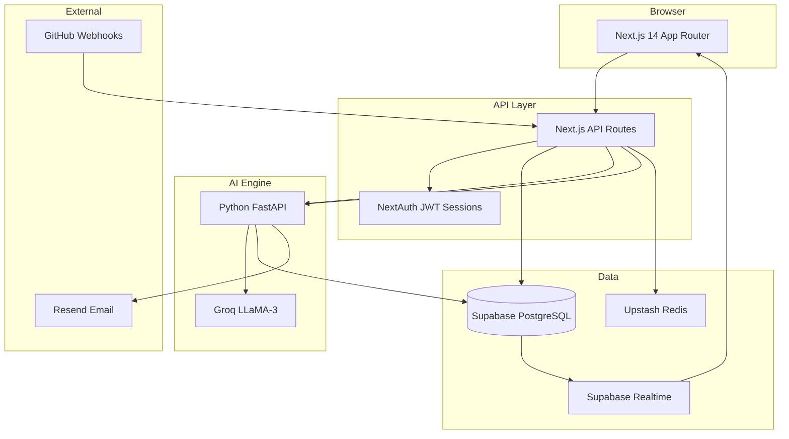

---

## Tech Stack

| Layer | Technology | Role |
|-------|-----------|------|
| Frontend | Next.js 14, React 18, Tailwind CSS | App Router, SSR, responsive UI |
| Charts | Recharts | Line charts, bar charts, radar charts |
| Animation | Framer Motion | PR card transitions, page animations |
| Auth | NextAuth v4 | GitHub OAuth + demo credentials provider |
| Database | Supabase (PostgreSQL) | PR data, repos, users, views |
| Realtime | Supabase Realtime | Live PR status updates |
| AI Engine | Python FastAPI + Groq | Code analysis, scoring, summaries |
| Cache | Upstash Redis | Webhook deduplication |
| Email | Resend | Critical security alerts |
| Theming | next-themes | Dark/light mode toggle |
| Toasts | Sonner | Action feedback notifications |
| Types | Shared package (`@noctua/types`) | End-to-end type safety |

---

## Local Setup

### Prerequisites

- Node.js 18+
- npm 9+
- Python 3.10+ (only needed for the AI engine)

### Quick Start (Demo Mode)

Demo mode runs the full UI with mock data — no external services required.

```bash
# Clone and install
git clone https://github.com/your-org/noctua.git
cd noctua
npm install

# The .env is pre-configured for demo mode
# apps/web/.env already has DEMO_MODE=true

# Start the dev server
npm run dev

# Open http://localhost:3000
# Click "Enter Demo Mode" on the login page
```

### Full Setup (with External Services)

1. **Create accounts** for Supabase, GitHub OAuth App, Groq, Upstash, and Resend.

2. **Configure environment variables** in `apps/web/.env`:

```env
DEMO_MODE=false

NEXTAUTH_SECRET=<generate-a-secret>
NEXTAUTH_URL=http://localhost:3000

GITHUB_CLIENT_ID=<your-github-oauth-client-id>
GITHUB_CLIENT_SECRET=<your-github-oauth-client-secret>
GITHUB_WEBHOOK_SECRET=<your-webhook-secret>

SUPABASE_URL=<your-supabase-url>
SUPABASE_ANON_KEY=<your-anon-key>
SUPABASE_SERVICE_ROLE_KEY=<your-service-role-key>

UPSTASH_REDIS_REST_URL=<your-upstash-url>
UPSTASH_REDIS_REST_TOKEN=<your-upstash-token>

ENGINE_URL=http://localhost:8000
```

3. **Configure the engine** in `apps/engine/.env`:

```env
GROQ_API_KEY=<your-groq-key>
SUPABASE_URL=<your-supabase-url>
SUPABASE_SERVICE_ROLE_KEY=<your-service-role-key>
RESEND_API_KEY=<your-resend-key>
```

4. **Run both services**:

```bash
# Terminal 1: Web app
npm run dev

# Terminal 2: AI Engine
cd apps/engine
pip install -r requirements.txt
uvicorn main:app --reload --port 8000
```

---

## Project Structure

```
noctua/
├── apps/
│   ├── web/                    # Next.js 14 frontend
│   │   ├── app/
│   │   │   ├── page.tsx        # Landing page
│   │   │   ├── not-found.tsx   # Custom 404
│   │   │   ├── dashboard/      # Protected dashboard routes
│   │   │   │   ├── page.tsx           # Stat cards
│   │   │   │   ├── prs/page.tsx       # PR feed with filters
│   │   │   │   ├── prs/[id]/         # PR detail with score gauge
│   │   │   │   ├── team/page.tsx      # Leaderboard
│   │   │   │   ├── analytics/page.tsx # Charts
│   │   │   │   └── settings/page.tsx  # Repo management
│   │   │   ├── (auth)/login/   # Login page
│   │   │   └── api/            # API routes
│   │   ├── components/         # Reusable UI components
│   │   ├── lib/                # Auth, Supabase, utils, demo data
│   │   └── hooks/              # Custom React hooks
│   └── engine/                 # Python FastAPI AI service
│       ├── main.py
│       ├── routers/            # analyze, preflight, health
│       └── services/           # ai, github_client, email
├── packages/
│   └── types/                  # Shared TypeScript types
└── package.json                # npm workspaces root
```

---

## License

MIT
